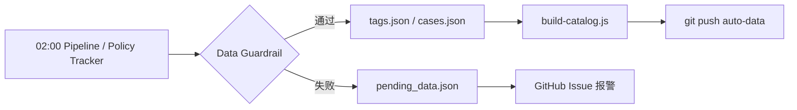

# 数据发布流程（自动发布 + 护栏拦截）

## 架构概览

| 区域 | 路径 | 用途 |
|------|------|------|
| **prod_data（线上）** | `data/tags.json`, `data/cases.json`, `data/catalog.json` | 用户搜索可见的正式数据 |
| **guardrail 拦截池** | `data/pending_data.json` | 质检失败、禁止自动上线的脏数据 |
| **legacy 待审队列** | `data/pending_data/queue.json` | 仅用于手动 override / 历史兼容（admin.html） |



## 自动发布（默认）

每日 02:00 工作流在 **质检通过** 后自动：

1. 合并写入 `data/tags.json` / `data/cases.json`
2. 重建 `data/catalog.json`
3. `git commit -m "auto-data: daily regulatory update [auto-publish]"` 并 push

**无需** 在 admin.html 逐条 Approve。

### 护栏规则（`lib/data-guardrail.js` / `pipeline/validate_guardrail.py`）

- 必填字段：`hs_code`, `direction`, `country`, `source`, `content_en` 等
- `country` 仅限：`US`, `EU`, `JP`, `KR`, `ASEAN`, `GLOBAL`
- `hs_code` 非空且非占位符（`ALL`, `00000000` 等）
- 内容不得含 AI 幻觉短语（`I'm sorry`, `As an AI`, `未找到对应内容` 等）

### 本地试运行

```bash
python3 pipeline/pipeline.py --offline
node scripts/auto-publish-pipeline.js
npm run build:catalog
```

## 异常人工介入

当存在拦截行时，工作流会创建 Issue：

`🚨 [Action Required] Clean-up Needed: N rows intercepted by Guardrail`

请检查 `data/pending_data.json`，修正后可用 admin 手动发布，或编辑 JSON 后 `npm run publish:reviewed`。

## admin.html（可选 override）

仍可用于 legacy `queue.json` 的手动批准/拒绝，或紧急 hotfix。日常流水线不再依赖此步骤。

```bash
ADMIN_REVIEW_PASSWORD='密码' npm run restart:admin
open http://127.0.0.1:8787/admin.html
```

## CI 说明

- Bot 提交 prod 数据须带 `[auto-publish]` 标记（流水线自动添加）
- 人工 override 仍可使用 `[admin-publish]`
