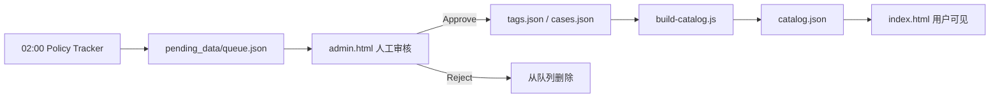

# 数据人审发布流程（prod_data / pending_data）

## 架构概览

| 区域 | 路径 | 用途 |
|------|------|------|
| **prod_data（线上）** | `data/tags.json`, `data/cases.json`, `data/catalog.json` | `index.html` 用户搜索看到的正式数据 |
| **pending_data（待审）** | `data/pending_data/queue.json` | 每日 02:00 AI 流水线写入，**未经你批准不会上线** |



## 已调整的自动写入逻辑

**之前：** `scripts/auto-parse-announcement.js --apply` 直接合并进 `data/tags.json` 并重建 catalog，CI 自动 push 到 `main`。

**现在：** `--apply` 只把新标签写入 `data/pending_data/queue.json`。  
`.github/workflows/policy-tracker.yml` 仅提交 `data/pending_data/queue.json` 与 `data/inbox/manifest.json`，**不再**自动改 `tags.json` / `catalog.json`。

## 日常审核步骤

### 1. 启动本地审核服务（仅监听 127.0.0.1）

**重要：** 若 8787 端口已有旧进程，Approve 可能失败（不支持 `risk_signal` 或缺少 publish-sync）。请先重启：

```bash
cd /path/to/Chinacomply
export ADMIN_REVIEW_PASSWORD='你的强密码'
npm run restart:admin
# 或: bash scripts/restart-admin-server.sh
```

浏览器打开：<http://127.0.0.1:8787/admin.html>（**不要**用 `file://` 打开）

登录后应看到 `build 20260529-risk-signal-v2`。Approve 请求发往：

`POST http://127.0.0.1:8787/api/review/approve`（Body: `{ "pending_id": "..." }`）

### 2. 在审核台操作

- **✅ Approve & Publish**：从 `pending_data` 移除 → 追加到 `data/tags.json`（或 `cases.json`）→ 自动运行 `node scripts/build-catalog.js`
- **❌ Reject**：仅从待审队列删除，不改动线上数据

### 3. 发布到 GitHub Pages（三路径一次性推送）

批准后本地文件已更新，**必须一次性**提交并推送核心路径（防止 Pages / FC / 队列不一致）：

```bash
npm run build:catalog
npm run publish:reviewed -- --dispatch
```

等价于 `git add` + `commit [admin-publish]` + `push`，并触发 `sync-prod-deploy` 重新部署 FC。

用户刷新 <https://careyc82.github.io/Trade-Comply/> 即可看到新规则。

### 命令行（可选）

```bash
node scripts/apply-review-action.js --list
node scripts/apply-review-action.js --approve pend_1730000000_abcd1234
node scripts/apply-review-action.js --reject pend_1730000000_abcd1234
```

## 本地测试整条流水线

```bash
# 模拟凌晨任务（离线 fixture）
node scripts/run-policy-tracker.js --offline

# 查看待审
node scripts/apply-review-action.js --list

# 启动审核台并批准
ADMIN_REVIEW_PASSWORD=test node scripts/admin-server.js
```

## 安全说明

- `admin.html` 含 `noindex`，且审核 API **只应通过** `admin-server.js` 在 `127.0.0.1` 使用。
- **不要**把 `ADMIN_REVIEW_PASSWORD` 写进前端仓库或 GitHub Pages 部署包。
- 若将来需要远程审核，应在 FC 上单独实现带 Token 的接口，并配合 GitHub Contents API 或私有存储；当前版本以本地审核 + git push 为准。

## 扩展：HS 风险案例入队

在任意脚本中调用：

```javascript
const { stagePendingItems } = require('./lib/data-review');
stagePendingItems({
  cases: [newCaseObject],
  meta: { source: 'manual' },
  source: 'hs-risk-pipeline'
});
```

`kind: 'tag'` 与 `kind: 'case'` 在审核台会分别展示为「政策标签」与「HS 风险案例」。
