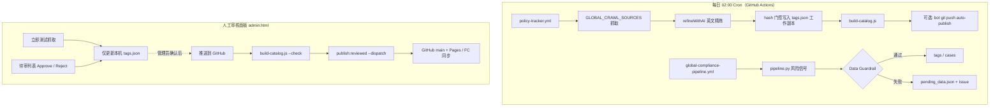

# 数据发布标准流程（SOP）

本文档与 [README.md](../README.md) 的 **Developer Workflow & Data Review SOP** 一致，描述当前实现下的**自动抓取**与**人工审核面板**分工。

---

## 架构一览

| 区域 | 路径 | 用途 |
|------|------|------|
| **线上生产数据** | `data/tags.json`, `data/cases.json`, `data/catalog.json` | 用户搜索可见；须通过 catalog 校验后随 git push 上线 |
| **全球抓取状态** | `data/global-crawl-manifest.json`, `data/inbox/manifest.json` | 按来源/国家记录 route hash，避免重复写入 |
| **人工待审队列（staging）** | `data/pending_data/queue.json` | 解析器/legacy 流水线写入；管理员在面板中 Approve / Reject |
| **护栏拦截池** | `data/pending_data.json` | 质检失败、禁止自动上线的脏数据（多由 Python 管道写入） |



---

## 一、自动层：Cron 抓取 + AI 精炼（staging）

每日 **北京时间约 02:00** 运行两条互补工作流（均在 GitHub Actions，非阿里云 FC）：

### 1. `policy-tracker.yml` — 全球官方公告爬虫（主路径）

触发：`cron: 0 18 * * *`（UTC，对应 CST 02:00）或 `workflow_dispatch`。

执行链：

1. `scripts/run-policy-tracker.js`
2. `scripts/fetch-global-pipeline.js` → **`lib/global-compliance-crawler.js`**
3. 对 `GLOBAL_CRAWL_SOURCES`（MOFCOM、GAC、BIS、CBP、EUR-Lex）逐源抓取
4. **`refineWithAI()`**（DeepSeek）输出英文 JSON：`relevant`, `impact_countries`, `industry`, `direction`, `summary_en`
5. `relevant: false` 的行政/农业等噪声**不写入** tags
6. 相关且 hash 变化时写入合规格 `tag_id`（`CL-GLPOL-*`，满足 `catalog.schema.json`）
7. 在 CI 上重建 `data/catalog.json`

**Staging 含义：** 在 bot `git push` 之前，变更仅存在于 CI 工作副本；管理员可在合并到 `main` 前审阅 Actions 日志或 PR。通过后 bot 以 `auto-data: … [auto-publish]` 提交 `tags.json` / `catalog.json` 等。

本地模拟 Cron（不 push）：

```bash
DEEPSEEK_API_KEY=sk-... npm run fetch:global:pipeline
# 或
npm run policy:track
```

### 2. `global-compliance-pipeline.yml` — 多国风险信号（Python）

约 02:05 CST 运行 `pipeline/pipeline.py`：结构化风险信号 → **Data Guardrail** → 通过则合并进 prod JSON；失败行进入 `data/pending_data.json` 并可能开 Issue。

### 3. Legacy 待审队列（仍支持）

部分解析脚本（如 `auto-parse-announcement.js`）可将候选写入 **`data/pending_data/queue.json`**，**不会**自动上线，需管理员在面板 **Approve** 后才写入 `data/tags.json`。

---

## 二、人工层：Manual Review Panel（`admin.html`）

本地启动审核 API：

```bash
# 项目根目录配置 .env.local：ADMIN_REVIEW_PASSWORD、DEEPSEEK_API_KEY
npm run restart:admin
open http://127.0.0.1:8787/admin.html
```

API 基址填 **`http://127.0.0.1:8787`**（不要用静态站 8000 端口）。

### 操作 A — 「立即测试抓取」

- 请求：`GET /api/test-crawl?persist=1`（需 Bearer 审核密码）
- 行为：与 Cron 相同的 **Global Compliance Crawler**（抓取 → `refineWithAI` → hash 门控写**本机** `data/tags.json`）
- **不会**自动 `git push`
- 终端可见 `[GLOBAL-CRAWL] [FETCHING]` / `[AI-EVAL]` / `[SUCCESS]` 等日志
- 响应含 `{ changed, errors }` 供面板展示

用途：验证来源 URL、API Key、AI 分类与 tag 写入，再决定是否推送。

### 操作 B — 待审队列（Approve / Reject）

- 列表来自 `data/pending_data/queue.json`
- **Approve**：将单条 payload 合并进本机 `data/tags.json` / `cases.json` 并移出队列
- **Reject**：仅从队列删除

适用于 legacy 解析结果或人工补录项；**不是**全球 Cron 每条公告的必经步骤（Cron 可直接 bot 发布）。

### 操作 C — 「推送到 GitHub」（上线必经）

管理员确认本机数据无误后点击 **推送到 GitHub**，或终端执行等价命令：

```bash
npm run build:catalog          # 生成/更新 catalog.json
npm run publish:reviewed -- --dispatch
```

**`publish-sync`（面板按钮）内部逻辑：**

1. `scripts/build-catalog.js --check` — **全量 catalog 合法性校验**（含 `tag_id` 正则 `^CL-[A-Z]+-\d+$` 等）
2. 校验失败则**拒绝推送**（例如非法 `CL-GLOBAL-*` 旧格式）
3. 通过后一次性 commit 并 push 以下路径（须同批、不可只推部分）：
   - `data/tags.json`
   - `data/cases.json`（如有变更）
   - `data/catalog.json`
   - `data/pending_data/queue.json`
4. Commit 信息须含 **`[admin-publish]`**（CI 护栏识别人工发布）
5. `--dispatch` 触发 `repository_dispatch: prod-data-published` → [sync-prod-deploy.yml](../.github/workflows/sync-prod-deploy.yml) 重部署 FC / 同步生产 JSON

---

## 三、标准作业顺序（推荐）

| 场景 | 步骤 |
|------|------|
| **日常自动更新** | 依赖 02:00 Cron；次日 `git pull` 检查 `main` 上 `[auto-publish]` 提交；有 Guardrail Issue 时处理 `pending_data.json` |
| **本地验证爬虫** | `git pull` → admin **立即测试抓取** → 看日志与 `changed` / `errors` |
| **人工上线** | 队列 **Approve**（如有）→ `npm run build:catalog` → **推送到 GitHub** 或 `npm run publish:reviewed -- --dispatch` |
| **紧急修正** | 直接编辑 `data/tags.json` → `build:catalog` → `publish:reviewed -- --dispatch` |

**铁律：** 任何对用户可见的 prod 变更，必须经过 **`build-catalog.js` 校验** 且 **三路径（+ queue）同批 push**。

---

## 四、护栏与 CI

| 机制 | 说明 |
|------|------|
| `lib/data-guardrail.js` | 风险信号必填字段、国家白名单、反幻觉短语 |
| `js/catalog.js` + `data/catalog.schema.json` | `tag_id` / `case_id` 格式；全球政策须为 `CL-GLPOL-{数字}` |
| `ci-guardrail.yml` | 阻止 bot 未经 `[auto-publish]` / `[admin-publish]` 标记修改 prod |
| Guardrail Issue | `🚨 [Action Required] …` 提示清理拦截数据 |

---

## 五、环境变量

| 变量 | 用途 |
|------|------|
| `DEEPSEEK_API_KEY` | Cron + 本地 `refineWithAI`（`.env.local` 或 Actions Secrets） |
| `ADMIN_REVIEW_PASSWORD` | admin API Bearer 令牌 |
| `GITHUB_TOKEN` | 面板推送 / `publish:reviewed --dispatch` |
| `AUTO_PUBLISH_SYNC=1` | 可选：每次 Approve 后自动尝试 push（多数团队仍用手动「推送到 GitHub」） |

更多工程细节见 [ENGINEERING.md](ENGINEERING.md)。
